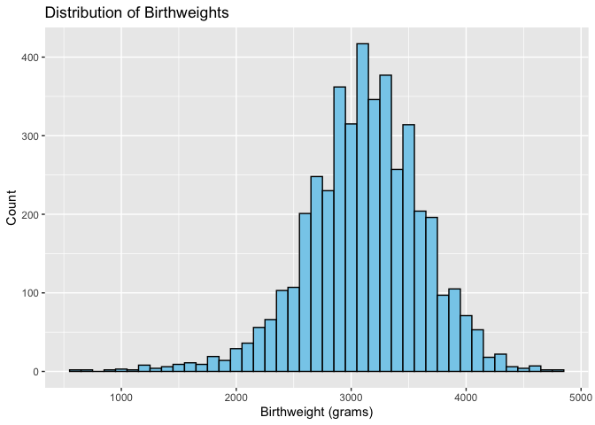

p8105_hw6_am6594
================
Alice Mao
2024-12-03

``` r
# Load necessary libraries
library(tidyverse)
```

    ## ── Attaching core tidyverse packages ──────────────────────── tidyverse 2.0.0 ──
    ## ✔ dplyr     1.1.4     ✔ readr     2.1.5
    ## ✔ forcats   1.0.0     ✔ stringr   1.5.1
    ## ✔ ggplot2   3.5.1     ✔ tibble    3.2.1
    ## ✔ lubridate 1.9.3     ✔ tidyr     1.3.1
    ## ✔ purrr     1.0.2     
    ## ── Conflicts ────────────────────────────────────────── tidyverse_conflicts() ──
    ## ✖ dplyr::filter() masks stats::filter()
    ## ✖ dplyr::lag()    masks stats::lag()
    ## ℹ Use the conflicted package (<http://conflicted.r-lib.org/>) to force all conflicts to become errors

``` r
library(broom)
library(purrr)
library(modelr)
```

    ## 
    ## Attaching package: 'modelr'
    ## 
    ## The following object is masked from 'package:broom':
    ## 
    ##     bootstrap

``` r
library(crossval)
library(scales)
```

    ## 
    ## Attaching package: 'scales'
    ## 
    ## The following object is masked from 'package:purrr':
    ## 
    ##     discard
    ## 
    ## The following object is masked from 'package:readr':
    ## 
    ##     col_factor

``` r
library(rnoaa)
```

    ## The rnoaa package will soon be retired and archived because the underlying APIs have changed dramatically. The package currently works but does not pull the most recent data in all cases. A noaaWeather package is planned as a replacement but the functions will not be interchangeable.

# Problem 1

``` r
# Download data
weather_df = 
  rnoaa::meteo_pull_monitors(
    c("USW00094728"),
    var = c("PRCP", "TMIN", "TMAX"), 
    date_min = "2017-01-01",
    date_max = "2017-12-31") %>%
  mutate(
    name = recode(id, USW00094728 = "CentralPark_NY"),
    tmin = tmin / 10,
    tmax = tmax / 10) %>%
  select(name, id, everything())
```

    ## using cached file: /Users/alice/Library/Caches/org.R-project.R/R/rnoaa/noaa_ghcnd/USW00094728.dly

    ## date created (size, mb): 2024-12-01 21:52:24.128223 (8.667)

    ## file min/max dates: 1869-01-01 / 2024-11-30

``` r
# Preview data
head(weather_df)
```

    ## # A tibble: 6 × 6
    ##   name           id          date        prcp  tmax  tmin
    ##   <chr>          <chr>       <date>     <dbl> <dbl> <dbl>
    ## 1 CentralPark_NY USW00094728 2017-01-01     0   8.9   4.4
    ## 2 CentralPark_NY USW00094728 2017-01-02    53   5     2.8
    ## 3 CentralPark_NY USW00094728 2017-01-03   147   6.1   3.9
    ## 4 CentralPark_NY USW00094728 2017-01-04     0  11.1   1.1
    ## 5 CentralPark_NY USW00094728 2017-01-05     0   1.1  -2.7
    ## 6 CentralPark_NY USW00094728 2017-01-06    13   0.6  -3.8

``` r
# Fit the linear regression model
lm_model <- lm(tmax ~ tmin, data = weather_df)
summary(lm_model)
```

    ## 
    ## Call:
    ## lm(formula = tmax ~ tmin, data = weather_df)
    ## 
    ## Residuals:
    ##     Min      1Q  Median      3Q     Max 
    ## -6.0304 -2.1245  0.0264  1.7264  9.4915 
    ## 
    ## Coefficients:
    ##             Estimate Std. Error t value Pr(>|t|)    
    ## (Intercept)  7.20850    0.22635   31.85   <2e-16 ***
    ## tmin         1.03924    0.01699   61.16   <2e-16 ***
    ## ---
    ## Signif. codes:  0 '***' 0.001 '**' 0.01 '*' 0.05 '.' 0.1 ' ' 1
    ## 
    ## Residual standard error: 2.938 on 363 degrees of freedom
    ## Multiple R-squared:  0.9115, Adjusted R-squared:  0.9113 
    ## F-statistic:  3741 on 1 and 363 DF,  p-value: < 2.2e-16

``` r
# Extract R^2
r_squared <- glance(lm_model)$r.squared
r_squared
```

    ## [1] 0.9115425

``` r
# Define the bootstrap function
set.seed(123)
bootstrap_samples <- weather_df %>%
  bootstrap(5000)

# Perform bootstrap analysis
#bootstrap_results <- bootstrap_samples %>%
 # mutate(
  #  models = map(strap, ~lm(tmax ~ tmin, data = .x)),
   # r_squared = map_dbl(models, ~glance(.x)$r.squared),
    #log_beta = map(models, ~tidy(.x)) %>%
     # map_dbl(~log(.[1, "estimate"] * .[2, "estimate"]))
  #)
```

# Problem 2

``` r
# Load the dataset
homicides <- read_csv("data/homicide-data.csv")
```

    ## Rows: 52179 Columns: 12
    ## ── Column specification ────────────────────────────────────────────────────────
    ## Delimiter: ","
    ## chr (9): uid, victim_last, victim_first, victim_race, victim_age, victim_sex...
    ## dbl (3): reported_date, lat, lon
    ## 
    ## ℹ Use `spec()` to retrieve the full column specification for this data.
    ## ℹ Specify the column types or set `show_col_types = FALSE` to quiet this message.

``` r
# Create city_state variable
homicides <- homicides %>%
  mutate(city_state = paste(city, state, sep = ", "))

# Create binary variable indicating whether the homicide is solved
homicides <- homicides %>%
  mutate(solved = if_else(disposition == "Closed by arrest", 1, 0))

# Omit specified cities
omit_cities <- c("Dallas, TX", "Phoenix, AZ", "Kansas City, MO", "Tulsa, AL")
homicides <- homicides %>%
  filter(!city_state %in% omit_cities)

# Limit analysis to cases where victim_race is "White" or "Black"
homicides <- homicides %>%
  filter(victim_race %in% c("White", "Black"))

# Ensure victim_age is numeric and remove rows with missing victim_age
homicides <- homicides %>%
  mutate(victim_age = as.numeric(victim_age)) %>%
  filter(!is.na(victim_age))
```

    ## Warning: There was 1 warning in `mutate()`.
    ## ℹ In argument: `victim_age = as.numeric(victim_age)`.
    ## Caused by warning:
    ## ! NAs introduced by coercion

``` r
# Filter data for Baltimore, MD
baltimore_data <- homicides %>%
  filter(city_state == "Baltimore, MD")

# Fit logistic regression model
baltimore_glm <- glm(solved ~ victim_age + victim_sex + victim_race, data = baltimore_data, family = binomial)

# Save output as an R object and tidy the results
baltimore_tidy <- tidy(baltimore_glm, conf.int = TRUE, exponentiate = TRUE)

# Obtain estimate and CI for adjusted OR comparing male to female victims
male_vs_female_or <- baltimore_tidy %>%
  filter(term == "victim_sexMale") %>%
  select(term, estimate, conf.low, conf.high)

# Display the result
male_vs_female_or
```

    ## # A tibble: 1 × 4
    ##   term           estimate conf.low conf.high
    ##   <chr>             <dbl>    <dbl>     <dbl>
    ## 1 victim_sexMale    0.426    0.324     0.558

``` r
# Filter out cities where victim_sex or victim_race has only one level
city_sex_race_counts <- homicides %>%
  group_by(city_state) %>%
  summarize(
    sex_levels = n_distinct(victim_sex),
    race_levels = n_distinct(victim_race)
  )

valid_cities <- city_sex_race_counts %>%
  filter(sex_levels > 1, race_levels > 1) %>%
  pull(city_state)

homicides_filtered <- homicides %>%
  filter(city_state %in% valid_cities)

# Run glm for each city with error handling
city_models <- homicides_filtered %>%
  group_by(city_state) %>%
  nest() %>%
  mutate(
    model = map(data, ~ safely(glm)(solved ~ victim_age + victim_sex + victim_race, data = ., family = binomial))
  )

# Extract the results, handling errors
city_models <- city_models %>%
  mutate(model_result = map(model, "result"), model_error = map(model, "error"),
         tidied = map(model_result, ~ if(!is.null(.x)) tidy(.x, conf.int = TRUE, exponentiate = TRUE) else NULL))
```

    ## Warning: There were 45 warnings in `mutate()`.
    ## The first warning was:
    ## ℹ In argument: `tidied = map(...)`.
    ## ℹ In group 1: `city_state = "Albuquerque, NM"`.
    ## Caused by warning:
    ## ! glm.fit: fitted probabilities numerically 0 or 1 occurred
    ## ℹ Run `dplyr::last_dplyr_warnings()` to see the 44 remaining warnings.

``` r
# Extract adjusted ORs and CIs for victim_sexMale
or_results <- city_models %>%
  unnest(tidied) %>%
  filter(term == "victim_sexMale") %>%
  select(city_state, estimate, conf.low, conf.high)
```

``` r
# Organize cities according to estimated OR
or_results <- or_results %>%
  arrange(estimate) %>%
  mutate(city_state = factor(city_state, levels = city_state))

# Create the plot
ggplot(or_results, aes(x = estimate, y = city_state)) +
  geom_point() +
  geom_errorbarh(aes(xmin = conf.low, xmax = conf.high), height = 0.2) +
  geom_vline(xintercept = 1, linetype = "dashed", color = "red") +
  xlab("Adjusted Odds Ratio (Male vs Female Victims)") +
  ylab("City") +
  ggtitle("Adjusted Odds Ratios for Solving Homicides by City") +
  theme_minimal()
```

<!-- -->

This plot shows adjusted odds ratios (ORs) for solving homicides by
city, comparing male versus female victims. The x-axis represents the
odds ratio, with a red reference line at OR = 1, indicating no
difference between male and female victims in terms of case resolution.
Values above 1 suggest that cases involving male victims are more likely
to be solved, while values below 1 indicate a higher likelihood for
cases involving female victims. While the majority of cities have ORs
near 1, indicating similar likelihoods of solving cases for both
genders, some cities show substantial deviations. Notably, the wide
confidence intervals for some cities indicate a lack of precision,
possibly due to smaller sample sizes or greater variability in the data.
These discrepancies suggest systemic or regional differences in
investigative priorities or resources, warranting further exploration of
local practices and socio-cultural factors influencing case resolutions.
The plot underscores the importance of understanding such disparities to
ensure equity in homicide investigations across gender and location.

# Problem 3

``` r
# Load the dataset
birthweight <- read_csv("data/birthweight.csv")
```

    ## Rows: 4342 Columns: 20
    ## ── Column specification ────────────────────────────────────────────────────────
    ## Delimiter: ","
    ## dbl (20): babysex, bhead, blength, bwt, delwt, fincome, frace, gaweeks, malf...
    ## 
    ## ℹ Use `spec()` to retrieve the full column specification for this data.
    ## ℹ Specify the column types or set `show_col_types = FALSE` to quiet this message.

``` r
# Briefly check the dataset
structure(birthweight)
```

    ## # A tibble: 4,342 × 20
    ##    babysex bhead blength   bwt delwt fincome frace gaweeks malform menarche
    ##      <dbl> <dbl>   <dbl> <dbl> <dbl>   <dbl> <dbl>   <dbl>   <dbl>    <dbl>
    ##  1       2    34      51  3629   177      35     1    39.9       0       13
    ##  2       1    34      48  3062   156      65     2    25.9       0       14
    ##  3       2    36      50  3345   148      85     1    39.9       0       12
    ##  4       1    34      52  3062   157      55     1    40         0       14
    ##  5       2    34      52  3374   156       5     1    41.6       0       13
    ##  6       1    33      52  3374   129      55     1    40.7       0       12
    ##  7       2    33      46  2523   126      96     2    40.3       0       14
    ##  8       2    33      49  2778   140       5     1    37.4       0       12
    ##  9       1    36      52  3515   146      85     1    40.3       0       11
    ## 10       1    33      50  3459   169      75     2    40.7       0       12
    ## # ℹ 4,332 more rows
    ## # ℹ 10 more variables: mheight <dbl>, momage <dbl>, mrace <dbl>, parity <dbl>,
    ## #   pnumlbw <dbl>, pnumsga <dbl>, ppbmi <dbl>, ppwt <dbl>, smoken <dbl>,
    ## #   wtgain <dbl>

``` r
# Convert appropriate variables to factors
birthweight <- birthweight %>%
  mutate(
    babysex = factor(babysex, labels = c("Male", "Female")),
    frace = factor(frace),
    malform = factor(malform, labels = c("Absent", "Present")),
    mrace = factor(mrace)
  )

# Check for missing data
missing_data <- colSums(is.na(birthweight))

# Summarize key variables
summary(birthweight)
```

    ##    babysex         bhead          blength           bwt           delwt      
    ##  Male  :2230   Min.   :21.00   Min.   :20.00   Min.   : 595   Min.   : 86.0  
    ##  Female:2112   1st Qu.:33.00   1st Qu.:48.00   1st Qu.:2807   1st Qu.:131.0  
    ##                Median :34.00   Median :50.00   Median :3132   Median :143.0  
    ##                Mean   :33.65   Mean   :49.75   Mean   :3114   Mean   :145.6  
    ##                3rd Qu.:35.00   3rd Qu.:51.00   3rd Qu.:3459   3rd Qu.:157.0  
    ##                Max.   :41.00   Max.   :63.00   Max.   :4791   Max.   :334.0  
    ##     fincome      frace       gaweeks         malform        menarche    
    ##  Min.   : 0.00   1:2123   Min.   :17.70   Absent :4327   Min.   : 0.00  
    ##  1st Qu.:25.00   2:1911   1st Qu.:38.30   Present:  15   1st Qu.:12.00  
    ##  Median :35.00   3:  46   Median :39.90                  Median :12.00  
    ##  Mean   :44.11   4: 248   Mean   :39.43                  Mean   :12.51  
    ##  3rd Qu.:65.00   8:  14   3rd Qu.:41.10                  3rd Qu.:13.00  
    ##  Max.   :96.00            Max.   :51.30                  Max.   :19.00  
    ##     mheight          momage     mrace        parity            pnumlbw 
    ##  Min.   :48.00   Min.   :12.0   1:2147   Min.   :0.000000   Min.   :0  
    ##  1st Qu.:62.00   1st Qu.:18.0   2:1909   1st Qu.:0.000000   1st Qu.:0  
    ##  Median :63.00   Median :20.0   3:  43   Median :0.000000   Median :0  
    ##  Mean   :63.49   Mean   :20.3   4: 243   Mean   :0.002303   Mean   :0  
    ##  3rd Qu.:65.00   3rd Qu.:22.0            3rd Qu.:0.000000   3rd Qu.:0  
    ##  Max.   :77.00   Max.   :44.0            Max.   :6.000000   Max.   :0  
    ##     pnumsga      ppbmi            ppwt           smoken           wtgain      
    ##  Min.   :0   Min.   :13.07   Min.   : 70.0   Min.   : 0.000   Min.   :-46.00  
    ##  1st Qu.:0   1st Qu.:19.53   1st Qu.:110.0   1st Qu.: 0.000   1st Qu.: 15.00  
    ##  Median :0   Median :21.03   Median :120.0   Median : 0.000   Median : 22.00  
    ##  Mean   :0   Mean   :21.57   Mean   :123.5   Mean   : 4.145   Mean   : 22.08  
    ##  3rd Qu.:0   3rd Qu.:22.91   3rd Qu.:134.0   3rd Qu.: 5.000   3rd Qu.: 28.00  
    ##  Max.   :0   Max.   :46.10   Max.   :287.0   Max.   :60.000   Max.   : 89.00

``` r
# Visualize birthweight distribution
ggplot(birthweight, aes(x = bwt)) +
  geom_histogram(binwidth = 100, fill = "skyblue", color = "black") +
  labs(title = "Distribution of Birthweights", x = "Birthweight (grams)", y = "Count")
```

<!-- -->

``` r
# Hypothesized model
model_hypothesis <- lm(bwt ~ babysex + bhead + blength + delwt + gaweeks + ppbmi + smoken, data = birthweight)

# Add predictions and residuals
birthweight <- birthweight %>%
  add_predictions(model_hypothesis, var = "fitted") %>%
  add_residuals(model_hypothesis, var = "residuals")

# Plot residuals vs. fitted values
ggplot(birthweight, aes(x = fitted, y = residuals)) +
  geom_point(alpha = 0.5) +
  geom_hline(yintercept = 0, linetype = "dashed", color = "red") +
  labs(title = "Residuals vs Fitted Values", x = "Fitted Values", y = "Residuals")
```

<!-- -->

``` r
set.seed(123)

# Create cross-validation folds
cv_data <- crossv_mc(birthweight, n = 10)

# Fit and evaluate models
cv_results <- cv_data %>%
  mutate(
    model_hypothesis = map(train, ~lm(bwt ~ babysex + bhead + blength + delwt + gaweeks + ppbmi + smoken, data = as.data.frame(.))),
    model_main_effect = map(train, ~lm(bwt ~ blength + gaweeks, data = as.data.frame(.))),
    model_interact = map(train, ~lm(bwt ~ bhead * blength * babysex, data = as.data.frame(.))),
    
    # Calculate RMSE for test sets
    rmse_hypothesis = map2_dbl(model_hypothesis, test, ~sqrt(mean((predict(.x, as.data.frame(.y)) - as.data.frame(.y)$bwt)^2))),
    rmse_main_effect = map2_dbl(model_main_effect, test, ~sqrt(mean((predict(.x, as.data.frame(.y)) - as.data.frame(.y)$bwt)^2))),
    rmse_interact = map2_dbl(model_interact, test, ~sqrt(mean((predict(.x, as.data.frame(.y)) - as.data.frame(.y)$bwt)^2)))
  )

# Gather RMSE results
rmse_results <- cv_results %>%
  select(rmse_hypothesis, rmse_main_effect, rmse_interact) %>%
  pivot_longer(cols = everything(), names_to = "model", values_to = "rmse") %>%
  mutate(model = recode(model,
                        rmse_hypothesis = "Hypothesis",
                        rmse_main_effect = "Main Effect",
                        rmse_interact = "Interactions"))
```

``` r
# Plot RMSE distributions
ggplot(rmse_results, aes(x = model, y = rmse)) +
  geom_violin() +
  labs(title = "Cross-Validation RMSE Distributions",
       x = "Model",
       y = "RMSE") +
  theme_minimal()
```

<!-- -->

``` r
# Calculate average RMSE for each model
rmse_summary <- rmse_results %>%
  group_by(model) %>%
  summarize(mean_rmse = mean(rmse), .groups = "drop")

# Display RMSE summary
rmse_summary
```

    ## # A tibble: 3 × 2
    ##   model        mean_rmse
    ##   <chr>            <dbl>
    ## 1 Hypothesis        282.
    ## 2 Interactions      289.
    ## 3 Main Effect       335.

Based on the results, the hypothesis model is the most accurate and
consistent predictor of birthweight. In contrast, the main effect model
is the least accurate, likely due to the exclusion of important
variables and interaction terms. Although the interactions model is more
complex than the hypothesis model, it does not significantly improve
performance and introduces greater variability.
